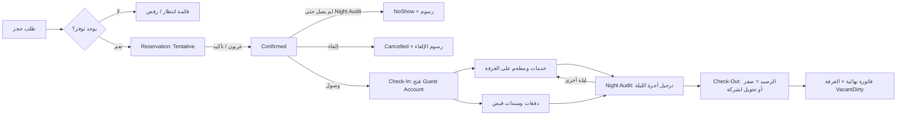

# دراسة نظام Hotel Management & Reservation System

> الاسم المعتمد: **Hotel Management & Reservation System** (بدون استخدام كلمة PMS حتى لا يختلط مع نظام الصيانة).
> اللغة: عربي/إنجليزي مع دعم RTL كامل.

---

## 1. الهدف

نظام متكامل لإدارة الفندق من لحظة طلب الحجز حتى مغادرة النزيل وإقفال حسابه، مع:

- منع الحجز المزدوج للغرفة نفسها.
- حساب نزيل (Guest Account / Folio) دقيق: كل حركة مالية مسجلة ولا تُحذف، والتصحيح يتم بقيد عكسي.
- تاريخ عمل فندقي (Business Date) مستقل عن تاريخ الجهاز، يُغلق يوميًا عبر **Night Audit**.
- ربط نقاط البيع داخل الفندق (المطعم، الكافيه، المغسلة، الميني بار) بحساب الغرفة.
- صلاحيات دقيقة وسجل تدقيق (AuditTrail) لكل عملية حساسة.

## 2. المستخدمون والأدوار

| الدور | المهام الأساسية |
|---|---|
| مدير النظام (Admin) | الإعدادات، المستخدمون، الصلاحيات، الضرائب، أنواع الغرف والأسعار |
| مدير الفندق (General Manager) | التقارير، الموافقات (خصومات، إلغاء رسوم، Overbooking)، مراجعة Night Audit |
| موظف الاستقبال (Front Desk) | الحجز، Check-In، Check-Out، نقل الغرفة، تمديد الإقامة |
| أمين الصندوق (Cashier) | القبض، سندات القبض، الاسترداد، فتح/إغلاق الوردية |
| موظف الحجوزات (Reservations) | حجوزات فردية ومجموعات، العربون، تأكيد/إلغاء |
| مدقق ليلي (Night Auditor) | تنفيذ Night Audit، ترحيل أجور الغرف، معالجة No-Show |
| التدبير الفندقي (Housekeeping) | حالة نظافة الغرف، مهام التنظيف، المفقودات |
| الصيانة (Maintenance) | بلاغات الأعطال، إخراج الغرفة من الخدمة وإعادتها |
| نقطة بيع (Outlet User) | ترحيل فواتير المطعم/الخدمات على حساب الغرفة |
| المحاسب (Accountant) | مراجعة الإيرادات، الذمم (City Ledger)، التصدير للمحاسبة |

## 3. الوحدات (Modules)

### 3.1 الإعدادات الأساسية (Setup)
- بيانات الفندق، العملة، الضرائب ورسوم الخدمة، السنة المالية.
- المباني/الطوابق، أنواع الغرف، الغرف، المزايا (Amenities).
- خطط الأسعار (Rate Plans): سعر أساسي، موسمي، نهاية أسبوع، شركات، شامل/غير شامل الإفطار.
- مصادر الحجز (Walk-in، هاتف، موقع، Booking/Expedia، شركة، وكيل سفر).
- أنواع الخدمات وأكواد الحركات المالية (Transaction Codes).

### 3.2 الحجوزات (Reservations)
- حجز فردي، حجز متعدد الغرف، حجز مجموعة (Group).
- البحث عن التوفر حسب التاريخ ونوع الغرفة (Availability).
- حالات الحجز: `Tentative` → `Confirmed` → `CheckedIn` → `CheckedOut`، أو `Cancelled` / `NoShow`.
- العربون (Deposit) وسياسة الإلغاء ورسوم الإلغاء.
- قائمة الانتظار (Waitlist) اختياري.
- شاشة **Room Rack / Timeline**: الغرف عموديًا والأيام أفقيًا مع السحب لتغيير التاريخ أو الغرفة.

### 3.3 الاستقبال (Front Office)
- Check-In: من حجز أو Walk-in، تسجيل بيانات النزلاء ووثائق الهوية، تخصيص الغرفة.
- نقل غرفة (Room Move)، تمديد/تقصير الإقامة، Early Check-In / Late Check-Out.
- قائمة الوصول والمغادرة اليومية (Arrivals / Departures / In-House).
- Check-Out: تسوية الحساب، إصدار الفاتورة النهائية، تحويل الرصيد لحساب شركة (City Ledger).

### 3.4 حسابات النزلاء (Guest Accounts / Folios)
- لكل إقامة حساب رئيسي، مع إمكانية تقسيمه (Split Folio): مثلًا الغرفة على الشركة والخدمات على النزيل.
- حساب رئيسي للمجموعة (Master Folio) وتوجيه الحركات (Routing).
- الحركات: أجرة غرفة، خدمات، ضرائب، خصومات، دفعات، استرداد، تصحيح (Reversal).
- لا حذف للحركات؛ التصحيح بقيد عكسي مع سبب وصلاحية.

### 3.5 الصندوق والدفعات (Cashiering)
- طرق الدفع: نقدي، بطاقة، تحويل، شيك، حساب شركة.
- سند قبض (Receipt Voucher) مرقم تسلسليًا، سند صرف/استرداد.
- الورديات (Shifts): فتح برصيد افتتاحي، إغلاق بعد الجرد، تقرير الوردية، فروقات الصندوق.
- عملات متعددة اختياري.

### 3.6 نقاط البيع داخل الفندق (Outlets)
- المطعم، الكافيه، Room Service، المغسلة، الميني بار، السبا…
- ترحيل الفاتورة على رقم الغرفة بعد التحقق من أن النزيل مقيم ومسموح له بالترحيل (Credit Allowed).
- إمكانية الربط مع نظام POS الخارجي عبر API بدلًا من شاشة داخلية.

### 3.7 التدقيق الليلي (Night Audit)
ينفذ مرة يوميًا ويغلق تاريخ العمل:
1. التحقق: لا ورديات مفتوحة، لا وصول معلّق، لا مغادرة متأخرة غير مسوّاة.
2. معالجة الحجوزات غير الواصلة (No-Show) وترحيل رسومها حسب السياسة.
3. ترحيل أجرة الليلة والضرائب على كل غرفة مشغولة.
4. تحديث حالة الغرف (Occupied → Dirty).
5. إصدار تقارير اليوم وحفظ لقطة الإحصائيات (Occupancy، ADR، RevPAR).
6. ترحيل تاريخ العمل لليوم التالي وقفل اليوم المغلق ضد التعديل.

### 3.8 التدبير الفندقي (Housekeeping)
- حالات الغرفة: `VacantClean`, `VacantDirty`, `OccupiedClean`, `OccupiedDirty`, `Inspected`, `OutOfOrder`, `OutOfService`.
- توزيع المهام على العاملين، تقرير التباين (Discrepancy) بين الاستقبال والتدبير.
- المفقودات (Lost & Found).

### 3.9 الصيانة (Maintenance)
- بلاغ عطل على غرفة، الأولوية، الفني المسؤول.
- إخراج الغرفة من البيع (`OutOfOrder`) لفترة محددة، وتمنع الحجز عليها تلقائيًا.

### 3.10 التقارير
- تشغيلية: الوصول، المغادرة، المقيمون، حالة الغرف، Room Rack، Forecast.
- مالية: الإيرادات اليومية حسب كود الحركة، تقرير الوردية، سندات القبض، الأرصدة المفتوحة، City Ledger.
- إدارية: نسبة الإشغال، ADR، RevPAR، المصادر، الجنسيات، الإلغاءات والـNo-Show.
- تصدير Excel/PDF لكل تقرير.

### 3.11 المستخدمون والصلاحيات وسجل التدقيق
- أدوار + صلاحيات تفصيلية (Permission لكل إجراء).
- AuditTrail: من، متى، ماذا (قبل/بعد)، من أي جهاز.

## 4. دورة العمل الرئيسية

## 5. قواعد العمل (Business Rules)

1. لا يمكن تخصيص غرفة لحجزين متداخلين في التاريخ (إلا بصلاحية Overbooking على مستوى نوع الغرفة وليس الغرفة).
2. الغرفة `OutOfOrder` لا تظهر في التوفر.
3. Check-In يتطلب: غرفة جاهزة (`VacantClean` أو `Inspected`)، بيانات هوية النزيل الرئيسي، وفتح Guest Account.
4. Check-Out مسموح فقط إذا كان رصيد الحساب صفرًا أو حُوّل إلى City Ledger بموافقة.
5. كل حركة مالية مرتبطة بـ Business Date ووردية ومستخدم، ولا تُحذف أبدًا.
6. بعد Night Audit يصبح اليوم مغلقًا؛ أي تصحيح يتم في اليوم الجديد بقيد عكسي.
7. الخصم فوق نسبة محددة يحتاج موافقة مدير.
8. أرقام الحجز والفواتير والسندات تسلسلية بلا فراغات.
9. أي تغيير على السعر أو الغرفة بعد Check-In يُسجل في AuditTrail.

## 6. متطلبات غير وظيفية

- واجهة عربية/إنجليزية RTL، تعمل على الكمبيوتر والتابلت.
- سرعة: شاشة Room Rack لـ 100 غرفة × 30 يومًا تفتح بأقل من ثانية.
- نسخ احتياطي يومي تلقائي.
- طباعة: فاتورة، سند قبض، بطاقة تسجيل النزيل (Registration Card).
- قابلية التوسع لاحقًا لعدة فنادق (Multi-Property) عبر حقل `HotelId` في الجداول الرئيسية منذ البداية.
- الفوترة الإلكترونية (مثل JoFotara في الأردن) كتكامل لاحق إذا لزم.

## 7. خيارات التقنية

| الخيار | المزايا | العيوب |
|---|---|---|
| **Laravel + MySQL** (مثل PMS_PHP_Laravel) | يعمل على استضافة Hostinger المشتركة، تجربة سابقة عندك، سريع التطوير | Realtime يحتاج Reverb/VPS أو Polling |
| **ASP.NET Core 9 + SQL Server** (مثل PMS2026) | قوي للأنظمة المالية، تقارير وطباعة ممتازة | يحتاج VPS أو Windows Server |
| **Vue 3 + Express + MySQL** (مثل POS2026New) | واجهة تفاعلية سريعة (Room Rack بالسحب)، تكامل سهل مع الـPOS | جهد أكبر في الصلاحيات والتقارير |

**التوصية:** Laravel 13 + MySQL مع Blade/Bootstrap RTL، وشاشة Room Rack بـ JavaScript تفاعلي. السبب: نفس بيئة النشر والأسلوب الموجود عندك، وقاعدة البيانات أدناه تناسب أي خيار.

## 8. مراحل التنفيذ المقترحة

| المرحلة | المحتوى | الناتج |
|---|---|---|
| 1 — الأساس | المستخدمون والصلاحيات، الإعدادات، أنواع الغرف والغرف، خطط الأسعار، AuditTrail | لوحة إعداد كاملة |
| 2 — الحجز والاستقبال | النزلاء، الحجوزات، التوفر، Room Rack، Check-In/Out، نقل الغرفة | دورة حجز تعمل |
| 3 — المالية | Guest Accounts، الحركات، الدفعات والسندات، الورديات، الفاتورة | حساب نزيل دقيق |
| 4 — Night Audit والتقارير | التدقيق الليلي، تقارير يومية ومالية وإدارية، Excel/PDF | إقفال يومي |
| 5 — العمليات | Housekeeping، Maintenance، Outlets، المجموعات وMaster Folio، City Ledger | النظام الكامل |
| 6 — التكاملات | ربط POS، الفوترة الإلكترونية، Channel Manager / Booking Engine | اختياري |

انظر [02-Database-Design.md](02-Database-Design.md) لتصميم الجداول، و[03-Open-Questions.md](03-Open-Questions.md) للقرارات المطلوبة.
