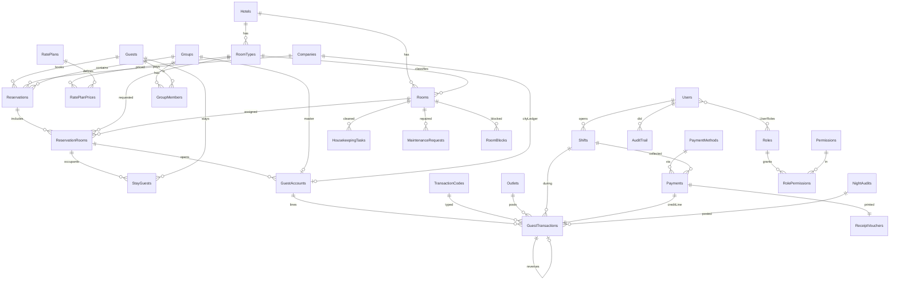

# تصميم قاعدة البيانات — Hotel Management & Reservation System

> الأسماء بالإنجليزية (PascalCase للجداول). كل جدول يحتوي ضمنيًا: `Id` (PK)، `CreatedAt`، `CreatedBy`، `UpdatedAt`، `UpdatedBy`.
> الجداول الرئيسية تحتوي `HotelId` للتوسع لعدة فنادق لاحقًا.
> المبالغ `DECIMAL(12,3)` (يناسب الدينار الأردني بثلاث خانات عشرية).

---

## 1. مخطط العلاقات (ERD)

## 2. الإعدادات والغرف

### Hotels
| الحقل | النوع | ملاحظات |
|---|---|---|
| NameAr / NameEn | varchar(150) | |
| TaxNumber | varchar(50) | للفواتير |
| CurrencyCode | char(3) | `JOD` |
| BusinessDate | date | **تاريخ العمل الحالي**؛ يتقدم فقط عبر Night Audit |
| CheckInTime / CheckOutTime | time | 14:00 / 12:00 |
| TaxPercent / ServicePercent | decimal(5,2) | |

### RoomTypes
| الحقل | النوع | ملاحظات |
|---|---|---|
| HotelId | FK | |
| Code | varchar(10) | `STD`, `DBL`, `SUI` — فريد لكل فندق |
| NameAr / NameEn | varchar(100) | |
| MaxAdults / MaxChildren | tinyint | |
| BedType | varchar(30) | |
| BaseRate | decimal | السعر الافتراضي إن لم يوجد Rate Plan |
| AllowOverbookingCount | int | 0 = ممنوع |
| SortOrder, IsActive | | |

### Rooms
| الحقل | النوع | ملاحظات |
|---|---|---|
| HotelId | FK | |
| RoomTypeId | FK → RoomTypes | |
| RoomNumber | varchar(10) | فريد لكل فندق |
| Floor / Building | varchar(20) | |
| HousekeepingStatus | enum | `Clean`, `Dirty`, `Inspected` |
| OccupancyStatus | enum | `Vacant`, `Occupied` (محسوبة من الإقامات وتُخزن للسرعة) |
| ServiceStatus | enum | `InService`, `OutOfOrder`, `OutOfService` |
| IsSmoking, Notes, IsActive | | |

> فصل الحالة إلى ثلاثة حقول أوضح من حقل واحد: Occupied + Dirty + InService = `OccupiedDirty`.

### RoomBlocks (إخراج الغرفة من البيع)
`RoomId`, `FromDate`, `ToDate`, `Type` (`OutOfOrder`/`OutOfService`), `Reason`, `MaintenanceRequestId` (nullable).

### RatePlans / RatePlanPrices
- **RatePlans**: `Code`, `NameAr/En`, `MealPlan` (`RO`, `BB`, `HB`, `FB`), `IsTaxInclusive`, `CancellationPolicyId`, `CompanyId` (nullable لأسعار الشركات).
- **RatePlanPrices**: `RatePlanId`, `RoomTypeId`, `FromDate`, `ToDate`, `DaysOfWeek` (bitmask)، `RateSingle`, `RateDouble`, `ExtraAdult`, `ExtraChild`.

### TransactionCodes (أكواد الحركات)
| الحقل | ملاحظات |
|---|---|
| Code | `ROOM`, `FNB`, `LAUN`, `MINI`, `TAX`, `SRV`, `DISC`, `CASH`, `CARD`, `TRANS`, `CL` |
| Type | `Charge` (مدين) / `Payment` (دائن) / `Adjustment` |
| RevenueGroup | Rooms / F&B / Other — للتقارير |
| IsTaxable, IsServiceCharged | لحساب الضريبة تلقائيًا |
| GlAccount | ربط محاسبي لاحقًا |

## 3. النزلاء والشركات والمجموعات

### Guests
`FullNameAr`, `FullNameEn`, `Gender`, `NationalityCode`, `IdType` (`NationalId`/`Passport`), `IdNumber`, `IdExpiry`, `DateOfBirth`, `Phone`, `Email`, `Address`, `VipLevel`, `IsBlacklisted`, `BlacklistReason`, `Notes`.
فهرس فريد: (`IdType`, `IdNumber`, `NationalityCode`) لمنع تكرار النزيل.

### Companies (شركات ووكلاء سفر)
`Name`, `TaxNumber`, `ContactPerson`, `Phone`, `CreditLimit`, `PaymentTermsDays`, `IsTravelAgent`, `CommissionPercent`.

### Groups / GroupMembers
- **Groups**: `Code`, `Name`, `CompanyId`, `ArrivalDate`, `DepartureDate`, `RoomsBlocked`, `CutOffDate`, `Status`, `MasterAccountId` (FK → GuestAccounts).
- **GroupMembers**: `GroupId`, `GuestId`, `ReservationRoomId` (nullable حتى التسكين).

## 4. الحجوزات والإقامة

### Reservations (رأس الحجز)
| الحقل | ملاحظات |
|---|---|
| ReservationNo | تسلسلي فريد `R-2026-000123` |
| HotelId | |
| BookerGuestId | FK → Guests (صاحب الحجز) |
| CompanyId / GroupId | nullable |
| SourceId | Walk-in / Phone / Website / OTA |
| ArrivalDate / DepartureDate | |
| Status | `Tentative`, `Confirmed`, `CheckedIn`, `CheckedOut`, `Cancelled`, `NoShow` |
| DepositRequired / DepositDueDate | |
| CancelledAt / CancelReason / CancellationFee | |
| Notes, ExternalRef | رقم Booking مثلًا |

### ReservationRooms (سطر لكل غرفة في الحجز = الإقامة)
| الحقل | ملاحظات |
|---|---|
| ReservationId | FK |
| RoomTypeId | النوع المطلوب |
| RoomId | nullable حتى التخصيص |
| ArrivalDate / DepartureDate | قد تختلف عن رأس الحجز |
| Adults / Children | |
| RatePlanId / NightlyRate / DiscountPercent | السعر المتفق عليه يُثبت هنا |
| Status | نفس حالات الحجز لكن لكل غرفة |
| ActualCheckIn / ActualCheckOut | datetime |

> **منع الحجز المزدوج:** قبل حفظ `RoomId` نتحقق من عدم وجود سطر آخر بنفس الغرفة وبحالة فعالة حيث
> `Arrival < newDeparture AND Departure > newArrival`، داخل Transaction مع قفل الصف (`SELECT … FOR UPDATE`).

### ReservationRoomRates (اختياري — سعر لكل ليلة)
`ReservationRoomId`, `StayDate`, `Rate` — يسمح بأسعار مختلفة لكل ليلة ويستخدمه Night Audit مباشرة.

### StayGuests (النزلاء الفعليون في الغرفة)
`ReservationRoomId`, `GuestId`, `IsPrimary`, `RegistrationCardNo`.

## 5. الحسابات المالية — قلب النظام

### GuestAccounts (الحساب / Folio)
| الحقل | ملاحظات |
|---|---|
| AccountNo | تسلسلي |
| AccountType | `Guest` (لغرفة)، `Master` (لمجموعة)، `CityLedger` (لشركة)، `NonGuest` (زبون خارجي/حدث) |
| ReservationRoomId | للحساب من نوع Guest |
| GroupId / CompanyId | للـ Master / CityLedger |
| FolioWindow | 1..n لتقسيم الحساب (غرفة على الشركة، خدمات على النزيل) |
| PayerGuestId / PayerCompanyId | من سيدفع |
| CreditLimit, AllowPosting | هل يسمح للمطعم بالترحيل |
| Status | `Open`, `Closed` |
| Balance | مجموع الحركات (مخزن ويُحدث مع كل حركة، ويُعاد احتسابه في Night Audit) |

### GuestTransactions (كل سطر مالي)
| الحقل | ملاحظات |
|---|---|
| GuestAccountId | FK |
| TransactionCodeId | FK |
| BusinessDate | تاريخ العمل وليس تاريخ الجهاز |
| Description | |
| Quantity / UnitPrice | |
| Amount | **موجب = مدين (رسوم)، سالب = دائن (دفعة/خصم)** |
| TaxAmount / ServiceAmount | |
| OutletId / OutletRef | مصدر الحركة (رقم فاتورة المطعم) |
| PaymentId | nullable — للحركات الدائنة الناتجة عن دفعة |
| NightAuditId | nullable — للحركات التي رحّلها التدقيق الليلي |
| ShiftId / UserId | |
| ReversalOfId | FK → GuestTransactions (القيد الذي يعكسه) |
| ReversedById | للسهولة في العرض |
| TransferredFromAccountId | عند نقل حركة بين الحسابات (Routing / Split) |
| IsLocked | true بعد إغلاق اليوم |

**دور GuestTransactions وعلاقته مع GuestAccounts وPayments:**
- `GuestAccounts` هو الدفتر، و`GuestTransactions` هي سطور الدفتر. رصيد الحساب = `SUM(Amount + TaxAmount + ServiceAmount)`.
- `Payments` تسجل **الدفعة نفسها** (المبلغ، الطريقة، رقم البطاقة المقنّع، العملة، الوردية). عند الحفظ يُنشأ سطر دائن واحد في `GuestTransactions` يشير إلى `PaymentId`، فينخفض الرصيد.
- `ReceiptVouchers` هي **الوثيقة المطبوعة** للدفعة (رقم تسلسلي، المبلغ كتابةً، توقيع). علاقة 1:1 مع Payments.
- الاسترداد = Payment بقيمة سالبة + سطر مدين + سند صرف.
- لا حذف ولا تعديل: التصحيح = سطر جديد بعكس المبلغ و`ReversalOfId`.

### Payments
`PaymentNo`, `GuestAccountId`, `PaymentMethodId`, `Amount`, `CurrencyCode`, `ExchangeRate`, `AmountInBase`, `CardLast4`, `ReferenceNo`, `IsDeposit`, `IsRefund`, `ShiftId`, `BusinessDate`, `UserId`, `Status` (`Posted`/`Voided`).

### ReceiptVouchers
`VoucherNo` (تسلسلي)، `PaymentId` (فريد)، `VoucherType` (`Receipt`/`Refund`)، `ReceivedFrom`, `AmountInWords`, `PrintedAt`, `PrintCount`.

### PaymentMethods
`Code` (`CASH`, `VISA`, `MASTER`, `TRANSFER`, `CHEQUE`, `CL`)، `TransactionCodeId`, `RequiresReference`, `IsCash` (للجرد في الوردية).

### Invoices / InvoiceLines
تُصدر عند Check-Out (أو عند الطلب): `InvoiceNo`, `GuestAccountId`, `BillToName`, `TaxNumber`, `SubTotal`, `Tax`, `Service`, `Total`, `EInvoiceUuid`/`EInvoiceStatus` (للفوترة الإلكترونية لاحقًا). السطور نسخة ثابتة من GuestTransactions وقت الإصدار.

## 6. نقاط البيع والورديات والتدقيق الليلي

### Outlets
`Code`, `NameAr/En`, `DefaultTransactionCodeId`, `AllowRoomPosting`, `ApiKey` (لربط POS خارجي).

### Shifts
`ShiftNo`, `UserId`, `CashierStation`, `OpenedAt`, `OpeningBalance`, `ClosedAt`, `ExpectedCash`, `CountedCash`, `Difference`, `Status` (`Open`/`Closed`), `BusinessDate`.

### NightAudits
| الحقل | ملاحظات |
|---|---|
| BusinessDate | التاريخ الذي تم إغلاقه (فريد) |
| StartedAt / FinishedAt / UserId | |
| Status | `Running`, `Completed`, `Failed` |
| RoomsOccupied / RoomsAvailable / OutOfOrder | لقطة اليوم |
| RoomRevenue / OtherRevenue / Payments | |
| Occupancy%, ADR, RevPAR | |
| NoShowsProcessed | |
| Log | json — تفاصيل الخطوات والأخطاء |

## 7. التدبير والصيانة

- **HousekeepingTasks**: `RoomId`, `TaskDate`, `TaskType` (`Departure`, `Stayover`, `Inspection`, `DeepClean`)، `AssignedTo`, `Status`, `StartedAt`, `FinishedAt`, `Notes`.
- **LostAndFound**: `RoomId`, `FoundAt`, `Description`, `FoundBy`, `Status`, `ReturnedTo`.
- **MaintenanceRequests**: `RoomId`, `Title`, `Priority`, `ReportedBy`, `AssignedTo`, `Status`, `BlocksRoom` (ينشئ RoomBlock تلقائيًا)، `ResolvedAt`.

## 8. المستخدمون والصلاحيات والتدقيق

- **Users**: `Username`, `PasswordHash`, `FullName`, `Language`, `IsActive`, `LastLoginAt`.
- **Roles**, **Permissions** (`Key` مثل `reservations.create`, `folio.reverse`, `nightaudit.run`, `discount.over_limit`)، **RolePermissions**, **UserRoles**.
- **AuditTrail**: `UserId`, `Action`, `EntityType`, `EntityId`, `OldValues` (json)، `NewValues` (json)، `Ip`, `CreatedAt`.

## 9. ربط دورة العمل بالجداول

| الخطوة | ما يحدث في الجداول |
|---|---|
| 1. حجز | `Reservations` (Tentative) + `ReservationRooms` (RoomTypeId، RoomId اختياري) + `Guests` |
| 2. عربون | `GuestAccounts` (Guest، Open) + `Payments` (IsDeposit) + `GuestTransactions` (دائن) + `ReceiptVouchers`؛ الحجز → Confirmed |
| 3. Check-In | تخصيص `ReservationRooms.RoomId` مع فحص التداخل؛ `StayGuests`؛ `ActualCheckIn`؛ `Rooms.OccupancyStatus = Occupied`؛ الحالة CheckedIn |
| 4. خدمات | `GuestTransactions` مدين بكود الخدمة + الضريبة، `OutletId` إن كانت من المطعم |
| 5. دفعات | `Payments` + سطر دائن + `ReceiptVouchers` ضمن `Shifts` المفتوحة |
| 6. Night Audit | لكل غرفة CheckedIn: سطر `ROOM` + `TAX` بـ `NightAuditId`؛ No-Show للحجوزات غير الواصلة؛ `Rooms.HousekeepingStatus = Dirty`؛ قفل حركات اليوم؛ `Hotels.BusinessDate += 1`؛ سجل `NightAudits` |
| 7. Check-Out | التحقق `Balance = 0` (أو نقل الرصيد إلى حساب `CityLedger` عبر `TransferredFromAccountId`)؛ `Invoices`؛ `GuestAccounts.Status = Closed`؛ `ActualCheckOut`؛ الغرفة Vacant + Dirty؛ `HousekeepingTasks` (Departure) |
| 8. ما بعد | City Ledger: دفعات الشركة لاحقًا على حسابها حتى الصفر |

## 10. الفهارس والقيود المهمة

- `Rooms (HotelId, RoomNumber)` فريد.
- `ReservationRooms (RoomId, ArrivalDate, DepartureDate)` فهرس لفحص التوفر بسرعة.
- `GuestTransactions (GuestAccountId, BusinessDate)` و`(BusinessDate, TransactionCodeId)` للتقارير.
- `NightAudits (HotelId, BusinessDate)` فريد.
- `Payments (PaymentNo)`, `ReceiptVouchers (VoucherNo)`, `Invoices (InvoiceNo)` فريدة وتسلسلية عبر جدول `Sequences` مع قفل.
- Foreign Keys بـ `RESTRICT` على الجداول المالية (لا حذف متسلسل).
